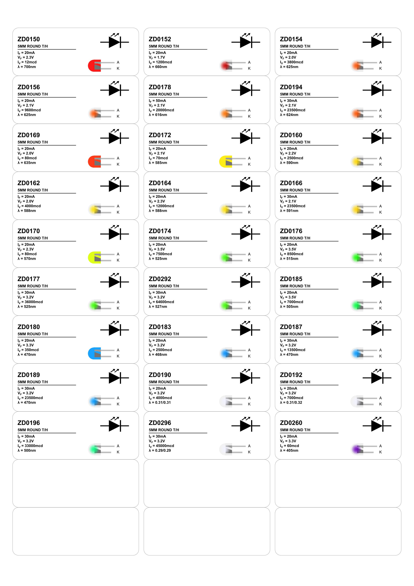
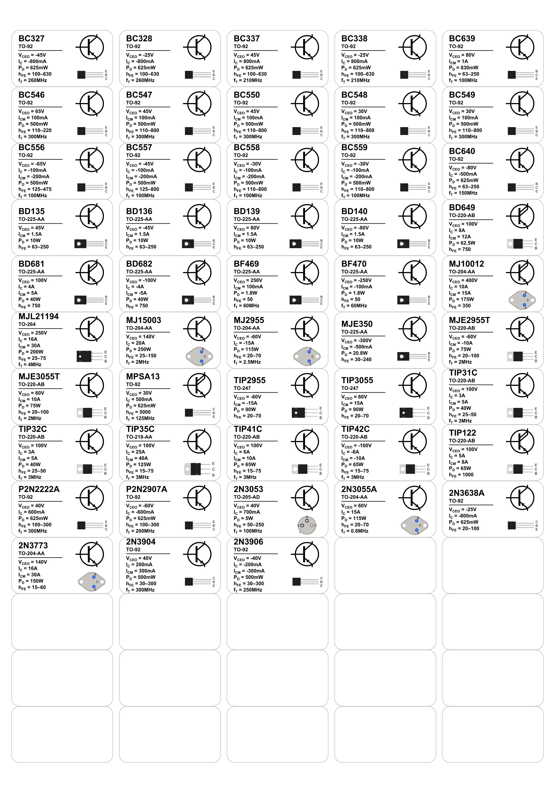
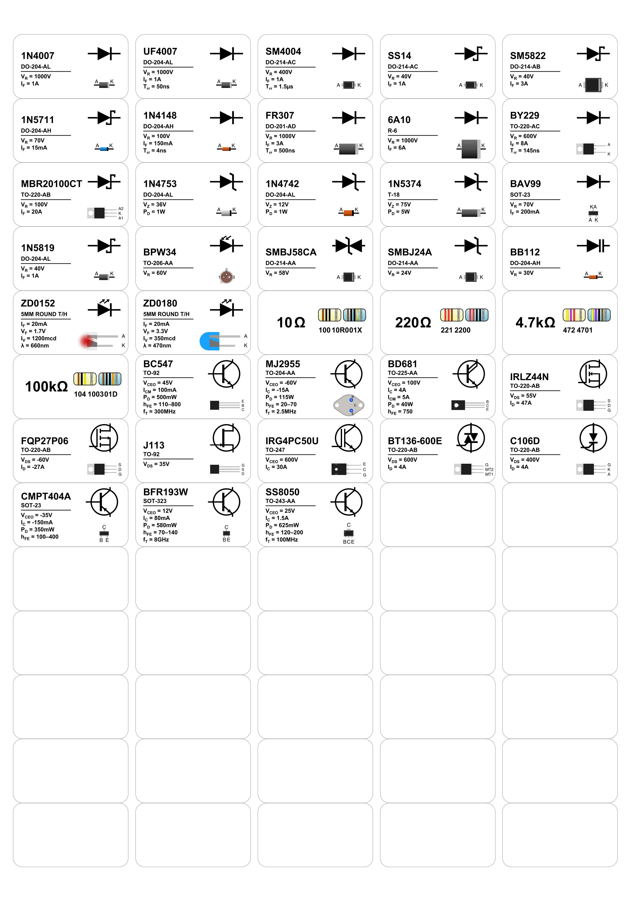

# PARTS — Package And Reference Tagging System

**PARTS** is a Python-based labelling engine for electronic components.
It generates clean, consistent PDF labels with accurate electrical symbols,
simplified-style package drawings and key specifications, suitable for electronics
labs, workshops and makerspaces.

PARTS is designed for engineers who care about correctness, repeatability and
long-term component organisation.

Originally based on **Finomnis/ResistorLabels**, PARTS has evolved into a
general-purpose component labelling system covering discrete passives, diodes,
transistors and power devices.

---

## Why PARTS?

Most label tools only print text.

PARTS prints meaning:

- Electrical symbols that match the device type
- Physical package drawings that match the real component
- Key electrical limits at a glance
- Consistent formatting across your entire lab

If you have ever pulled a part from a drawer and wondered “what exactly is this?”,
PARTS is for you.

---

## Features

- PDF label generation using ReportLab
- Automatic electrical symbol rendering
- Accurate package drawings
- JSON-driven configuration
- Mixed component sheets
- Support for common label templates:
  - Avery 5260
  - Avery L7157
  - Avery L7144
- Modular architecture:
  - components
  - symbols
  - packages
  - layouts
  - render engine

---

## Example Output

<p align="center">
  
  
  
</p>

---

## Example Configuration

```json
{
  "title": "My Components",
  "layout": "AVERY_5260",
  "options": {
		"draw_outlines": true
	},
  "labels": [
    { "kind": "resistor", "value_ohms": 4700 },
    {
      "kind": "diode",
      "part_number": "1N4148",
      "subtype": "signal",
      "package": "DO-35@glass",
      "spec": {
        "vr": "100V",
        "if": "150mA",
        "trr": "4ns"
      }
    }
  ]
}
```

---

## Installation

### Requirements

- Python 3.10 or newer
- reportlab

### Install Dependencies

```bash
pip install -r requirements.txt
```

### Clone Repository

```bash
git clone https://github.com/Reemson/PARTS
cd PARTS
```

---

## Usage

Generate a label sheet from a configuration file:

```bash
python main.py ./src/config/example_config.json
```

Change label layout in your configuration:

```json
{
  "layout": "AVERY_L7157"
}
```

You can draw outlines around the labels for test printing:

```json
{
  "options": {
    "draw_outlines": true
  }
}
```


---

## Supported Components

- Resistors
- Diodes:
  - Rectifier
  - Fast recovery
  - Schottky
  - Zener
  - TVS (uni and bi-directional)
  - Photodiodes
  - Varicaps
  - LEDs
- Transistors:
  - BJT (NPN, PNP, Darlington)
  - MOSFET (N and P channel)
  - JFET
  - IGBT
  - TRIAC
  - SCR

See `Supported-Packages.md` for full package coverage.

---

## Project Structure

```
src/
├─ components/     # High-level device renderers
├─ symbols/        # Electrical symbols
├─ packages/       # Physical package drawings
├─ layouts/        # Label sheet templates
├─ model/          # Typed device and spec models
└─ render_engine.py
```

---

## Extending PARTS

To add a new component type:

1. Add a spec dataclass in `src/model/`
2. Implement a renderer in `src/components/`
3. Add symbol drawing (optional)
4. Add package drawing (optional)
5. Register the renderer

PARTS is intentionally modular and contributor-friendly.

See `ROADMAP.md` for planned features and direction.

---

## Credits

PARTS began as a fork of:

ResistorLabels by Finomnis  
https://github.com/Finomnis/ResistorLabels

Copyright (c) 2020 Martin Stumpf  
Licensed under the MIT License.

This project substantially extends the original work.

---

## License

MIT License. See `LICENSE`.
